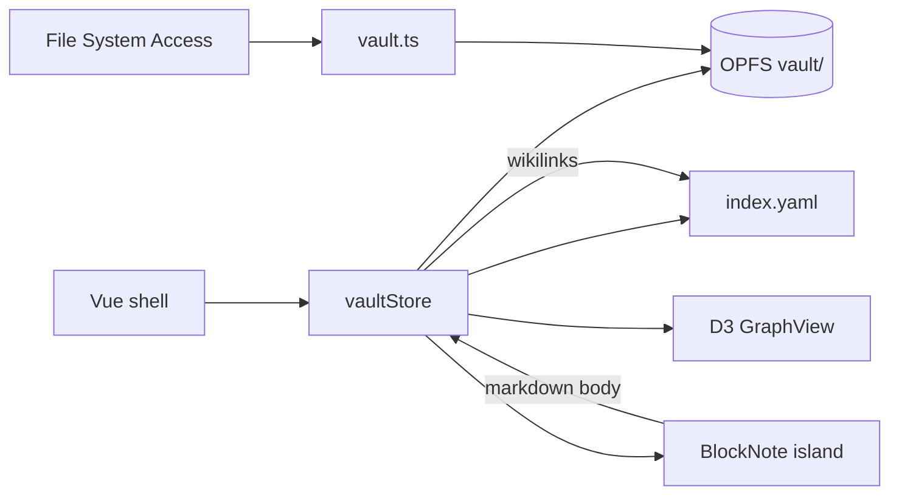

# Architecture

## Shape

k-thread is a **single-page application** with three concerns:

1. **Shell** — Vue 3 UI (sidebar, dialogs, view switching).
2. **Domain** — vault, wikilinks, graph index, tree (pure TypeScript under `src/lib`).
3. **Islands** — BlockNote (React) for editing; D3 for the graph canvas.

There is no remote API layer. Persistence is OPFS; deployment is static files.

## Module map

```
src/
  types.ts              # Option, Result, ViewMode, VaultStatus, Doc, GraphIndex, AppError
  main.ts / App.vue     # bootstrap + shell
  lib/
    opfs.ts             # low-level OPFS read/write/list/remove
    vault.ts            # vault load/import/persist orchestration
    vaultStore.ts       # reactive store (Vue reactive + computed)
    wikilink.ts         # parse/resolve [[links]], id/path helpers
    graph.ts            # build/serialize/parse index.yaml
    graphView.ts        # local/global view graph helpers
    tree.ts             # sidebar folder tree
    obsidian.ts         # markdown ↔ BlockNote dialect bridge
    markdown.ts         # preview helpers
  editor/
    BlockNoteApp.ts     # React mount/unmount
    obsidianSchema.ts   # custom BlockNote schema
    obsidianInline.ts   # wikilinks, tags, highlights
    obsidianBlocks.ts   # callouts, frontmatter, comments, fences
  components/
    shell/
      ToolRail.vue      # kube left rail (modes + tools)
      EditorStage.vue   # center stage (BlockNote / empty cube)
      Inspector.vue     # right panel (tags / links / preview)
    NoteSidebar.vue     # tree (Files drawer)
    BlockNoteEditor.vue # Vue wrapper around React island
    GraphView.vue       # D3 HUD graph (chips + wire bundles)
    *Dialog.vue         # create / rename / delete
    MarkdownPreview.vue # optional HTML preview + link navigate
```

## Data flow



1. On boot, `hydrateFromOpfs()` loads markdown + folders into `vaultStore`.
2. Edits update `Doc.body` and persist via `saveDoc` → OPFS.
3. `buildIndex(docs, folders)` recomputes nodes/edges from `[[wikilinks]]`.
4. Index is written to `index.yaml` alongside notes.
5. Graph and sidebar derive from store computeds — no second source of truth.

## State ownership

| Concern | Owner |
| --- | --- |
| Docs, folders, active note, view mode | `vaultStore.state` |
| Graph index | `computed` from docs (`buildIndex`) |
| Sidebar tree | `computed` (`buildNoteTree`) |
| Editor document | React island; synced through Vue props/events |
| Graph simulation | local to `GraphView.vue` (D3); selection emits upward |

## Boundaries

- **OPFS vs import**: OPFS is the working vault. “Import vault” copies a user-picked directory into OPFS (skipping `.obsidian`, `.git`, etc.).
- **Vue vs React**: only the editor is React. The rest of the app stays Vue to keep the shell cohesive.
- **Markdown as interchange**: BlockNote is the editing surface; disk format remains Obsidian-friendly markdown.

## Error model

I/O and parse paths return `Result<T, AppError>` with tagged `kind`s (`unsupported` | `io` | `parse`). UI reads `tag` and surfaces `message` on the store — never silent `null` returns.
