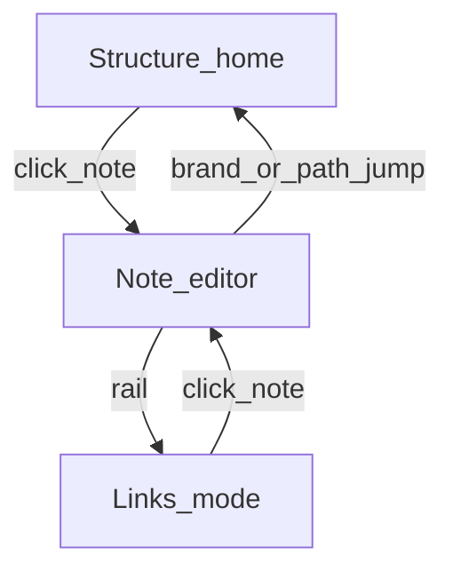

# Graph

k-thread has **two graphs**. They answer different questions and must stay on **separate canvases**.



## Why two graphs

| Question | Graph |
| --- | --- |
| Where am I in the vault? What folders exist? | **Structure** |
| What notes link to what? | **Links** |

Mixing folder edges and `[[wikilink]]` edges on one canvas confuses both jobs. Files drawer (⌘B) is a secondary peek — Structure is the primary browser.

## Structure (main page / home)

Project hierarchy as a light **workflow** (step widgets, not Links pills):

```
Vault → folders → notes
parent-path edges · top-down tidy tree · charcoal arrows
```

| Aspect | Detail |
| --- | --- |
| Default | Vault ready → Structure (refresh / import). Last note remembered for highlight / Note mode — **not** auto-opened. |
| Edges | Parent folder path only |
| Nodes | Vault root, folders, notes as white step cards (icon tile + title + meta + index) |
| Layout | Parent-aligned tidy tree (children under parent — funnel), not flat BFS rows |
| Click note | Open Note mode |
| Click folder | Focus / zoom that subtree |
| Return home | Brand mark (k-thread); path jump from Note header |
| Modules | `structureGraph.ts`, `structureDraw.ts`, `StructureView.vue` |

There is **no** “Structure” rail toggle required to show the tree — Structure *is* the main page. Rail View is Note / Links / Files / Preview.

## Links (separate mode)

Wikilink dependency graph (former “Graph” view):

```
Focus → Hop n · pastel pills · Global / Local scope
```

| Aspect | Detail |
| --- | --- |
| Edges | Real `[[wikilinks]]` from `buildIndex` → `index.yaml` |
| Nodes | One note = one pill; missing targets = hollow + dashed |
| Layout | Top-down BFS from focus; siblings fan horizontally |
| Scope | Global vault or Local N-hop neighborhood |
| Open | ToolRail **Links**; Inspector “Links graph” |
| Modules | `graph.ts`, `graphView.ts`, `graphHudDraw.ts`, `GraphView.vue` |

## View modes

```ts
export const ViewMode = {
  Structure: 'structure', // hierarchy home
  Note: 'note',           // editor
  Links: 'links',         // wikilink graph
} as const
```

Persisted via `session.ts` (`k-thread:lastView`, `k-thread:lastActiveId`). Legacy `'graph'` migrates to `Links`.

## Interaction (both canvases)

- Hover → brighten connected edges; dim the rest
- Drag nodes · pan / zoom · filter · reset view
- Never draw folder edges on the Links canvas, or wikilink edges on Structure

## Out of scope (for now)

- Hybrid “tree always visible + two graphs”
- Mixed folder + wikilink edges on one canvas
- Dark / neon graph chrome
